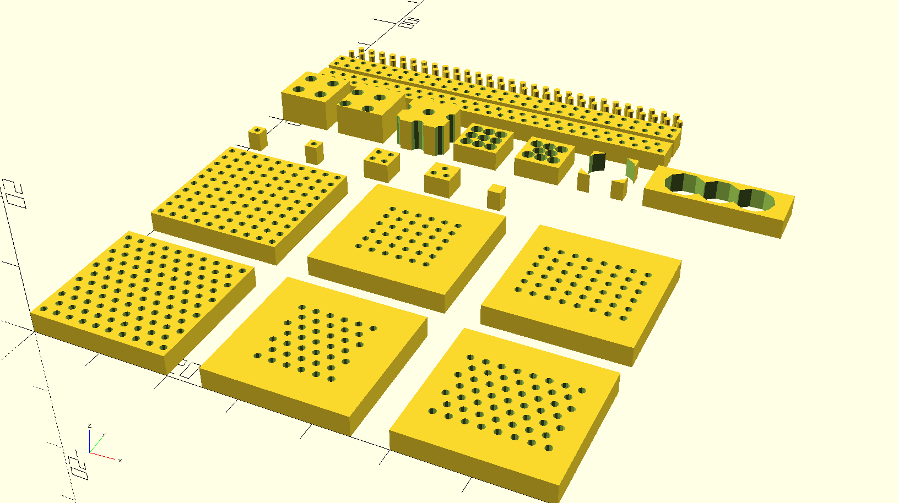

OpenSCAD library to generate various parametric pegboard-like shapes, i.e.
perforated rectangles.



See [Thingiverse](https://www.thingiverse.com/thing:3926282) for previews,
examples, etc. Customiser enabled, but really, it's not at all hard to just use
OpenSCAD for the job.

## Basic Usage

Download `pegboard.scad` and put it in the same directory as your project, then:

```
use <pegboard.scad>

board_dimensions = [30, 30, 3]; // 30mm x 30mm rectangle, 3mm thick
hole_diameter = 3; // 3mm holes
hole_pitch = 6; // hole centers 6mm apart

pegboard(board_dimensions, hole_diameter, hole_pitch);
```

(It's better to put it on the OpenSCAD library path rather than putting it in
your project directory, but that'll get you started).

## Modules:

* **`pegboard`**: produces a rectangular board with peg holes.

  Holes may optionally be less than full depth, and peg pattern may optionally
  be a square grid instead of the hexagonally packed default arrangement.
  Pitch, peg diameter and edge margins with no pegs are all customisable.

  `pegboard(dims, hole_diameter, hole_pitch)`
  `pegboard(dims, hole_diameter, hole_pitch, hexpattern, margins, center, hole_depth)`

* **`peg_grid`**: produces a rectangular arrangement of cylindrical pegs, i.e. a
  negative pegboard. Used to subtract from other objects. You can clip it etc
  too.

  `peg_grid(dims, peg_diameter, peg_pitch)`
  `peg_grid(dims, peg_diameter, peg_pitch, hexpattern, margins, center)`

## Parameters

All parameters may be passed as positional parameters or by name.

All dimensional units are millimeters.

* **`dims` (3-vector of +number, required)**:

  Vector `[x,y,z]` of dimensions of the pegboard, or in the case of the peg
  grid, the outer bounds within which the grid should be laid out. Positive
  number.

  For `peg_grid` the z-dimension is the peg length; for `pegboard` it's the
  board thickness and the holes default to fully punching through both sides of
  the board. Internally some slop is added when subtracting the pegs to ensure
  there are no floating point artifacts here.

* **`hole_diameter` / `peg_diameter` (+number, required)**:

  Diameter of the pegs/holes.

  Remember printer tolerances, print some tests for fit before you do a big
  print run, or print with extra wall thickness and be prepared to do some
  filing/drilling. Consider whether you're going for a friction fit or free
  movement too.

  TODO: support non-cylindrical pegs/holes: basic shapes, cylinders with
  friction grip knobs, and `children()` for arbitrary holes.

* **`hole_pitch` / `peg_pitch` (+number, required)**:

  Center-to-center spacing of the pegs/holes. The solid space between holes
  (the bridge size) will be `hole_pitch` - `hole_diameter`.  If set the same as
  `hole_diameter`, pegs/holes will touch. If less than `hole_diameter` the
  pegs/holes will intersect each other. See examples in test suite.

  A sensible initial choice can be `hole_diameter * 2`, which makes the spaces
  between pegs (bridges between holes) the same size as the pegs themselves.

* **`hexpattern` (boolean, optional)**:

  Arrange the pegs/holes in a tighter packed hexagonal pattern where every second
  row's pegs are horizontally offset by `hole_pitch/2` from the pegs on the
  adjacent rows. This yields a stronger shape because the pattern is now
  tesselated triangles instead of squares.  also gives more options for
  positioning things in the holes.

  hexpattern breaks y-symmetry if an even number of rows are produced.

  Default: `true`

* **`margins` (number or 2-vector of number, optional):**

  Margins around the edges of the board where no holes should be placed. Can be
  a 2-vector `[x,y]` or a scalar. Zero margins makes the hole edges touch the
  edge of the square defined by `dims` so it's the default for `peg_grid`,
  while `peg_board` defaults to a hole radius worth of margin.

  If `center=true` and the hole pitch/diameter doesn't cause the holes to fully
  pack the available space, actual effective will be slightly larger because
  the hole grid will get centered.

  Default: `peg_diameter/2` for `pegboard`, `0` for `peg_grid`.

* **`center` (boolean, optional):**

  Arrange the holes / peg grid within the supplied x/y `dims` bounds so that
  any extra space not filled by the peg grid is equal on both sides, i.e. the
  peg grid is centered. This enables you to safely mirror the peg grid across
  the y axis (flip horizontally) and have the holes in the mirrored pieces line
  up. It'll be vertically symmetrical too unless it's a hex pattern grid with an
  even number of rows.

  Default: `true`

## Examples

See the basic test suite in `pegboard_test.scad` for examples.

beam_margins = hole_pitch/2;

See `pegboard.scad`, its tests and its examples for all the things you can do with it.

## License and derivatives

This library is BSD licensed. The license specifies what you *can* do with it,
and nothing in the following restricts the permissions granted by the license.

I have a few requests that I would *appreciate* you following, though the
license does not require you to do so:

1. **Please do not create derivatives of this library on Thingiverse or
   elsewhere without linking to the original**. I would prefer that you submit
   changes to me for inclusion in the main library instead, if you can make
   them work without breaking the existing tests.
2. Credit me as original author if you publish derivatives. Feel free to credit
   me for the bugs too ;) .

## Testing

To test changes you make to the library, enable the run_tests parameter in the
file. It'll produce a set of tests. There are a few assertions in there for
basic functionality, but OpenSCAD doesn't make it easy to write useful tests
since it lacks the ability to introspect objects usefully. So you have to
eyeball it and compare the described expected results to what you see on the
test pattern. A sample test result `.stl` and `.png` is included.

## TODO

At some stage I may be motivated to:

* Support non-rectangular shapes
* Support non-cylindrical holes
* Use OpenSCAD's `children()` to let you define your own arbitrary hole modules

... none of which is hard, so if you want it, ask me for advice and I'll point you in the right direction.

Code contributions appreciated.

